<h1 align="center">Rodrigo Andrade</h1>
<h3 align="center">Senior frontend developer with 7+ years of experience in project, lead, and build web and mobile applications, since ERP, CRM, e-commerce and food delivery app's.</h3>

 

## :computer: About

- 🔭 I’m currently working on [ForSign](https://www.forsign.digital/)

- 🌱 I’m currently learning **React, NextJs, Jest and Styled Components**

- 📫 How to reach me **rcandrade@my.com**

 

## ⚡ Technologies

<!-- https://metrics.lecoq.io/ -->
